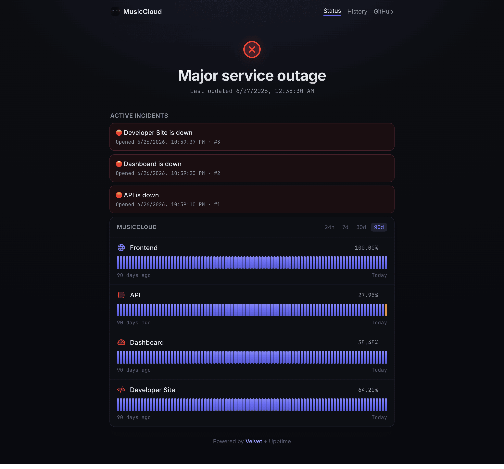

<div align="center">

# Velvet

**A polished, dark, open-source front-end for [Upptime](https://upptime.js.org) status pages.**

[](https://github.com/phranck/velvet/releases)
[](https://mit-license.org)
[](https://github.com/phranck/velvet/stargazers)
[](https://github.com/phranck/velvet/commits)
[](https://github.com/phranck/velvet/issues)
[](https://svelte.dev)
[](https://vite.dev)
[](https://upptime.js.org)



</div>

Indigo-monochrome, 90-day uptime bars, Phosphor duotone icons, live data straight from your Upptime repo — no server required.

## How it works

Velvet is a static Svelte app. It fetches your repo's `history/summary.json` and open GitHub issues **at runtime**, so the deployed bundle stays valid while Upptime keeps refreshing the data. Nothing project-specific is baked into the build — a generated `config.json` drives the owner/repo, brand, theme, and icons.

## Use it with an existing Upptime repo (GitHub Action)

Add a workflow that builds Velvet from your `.upptimerc.yml` and publishes it to GitHub Pages:

```yaml
name: Velvet
on:
  push:
    paths: [".upptimerc.yml", "assets/**"]
  schedule:
    - cron: "0 1 * * *"
  repository_dispatch:
    types: [static_site]
  workflow_dispatch:
permissions:
  contents: write
jobs:
  build:
    runs-on: ubuntu-latest
    steps:
      - uses: actions/checkout@v4
      - uses: phranck/velvet@v1
        with:
          config: .upptimerc.yml
          output: velvet-dist
      - uses: peaceiris/actions-gh-pages@v4
        with:
          github_token: ${{ secrets.GH_PAT || github.token }}
          publish_dir: velvet-dist
```

To stop Upptime's stock site build from fighting Velvet, list its workflow in `.templaterc.json` so template updates don't recreate it.

## Use it for a new project (Template)

No Upptime repo yet? Start from [velvet-template](https://github.com/phranck/velvet-template) — "Use this template" gives you Upptime monitoring plus Velvet, pre-wired.

## Configure

Velvet reads standard Upptime fields (`owner`, `repo`, `status-website.name`, `logoUrl`, `navbar`) plus a `velvet` block under `status-website`:

```yaml
status-website:
  name: MusicCloud
  logoUrl: https://example.com/logo.svg
  navbar:
    - { title: Status, href: / }
    - { title: History, href: https://github.com/$OWNER/$REPO/issues }
  velvet:
    accent: "#6366f1" # brand colour (indigo by default)
    accentDeg: "#d29922" # degraded
    accentDown: "#f85149" # down
    icons: # per-service Phosphor (duotone) icon classes
      frontend: ph-globe
      api: ph-brackets-curly
```

`$OWNER` / `$REPO` in navbar hrefs are substituted automatically.

## Develop

```bash
cd site
npm install
npm run dev   # http://localhost:5173, reads site/public/config.json
npm run build # → site/dist
```

`site/public/config.json` is a sample config used for local development; the Action regenerates it from each consumer's `.upptimerc.yml`.

## License

This repository has been published under the [MIT](https://mit-license.org) license.
