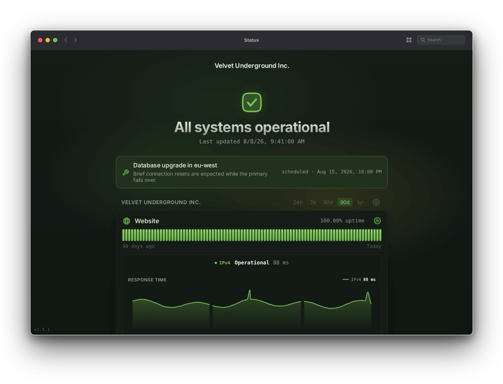

<div align="center">

# Velvet

**GitHub-native status monitoring and a polished status page, without a server or database.**

<a href="https://setup.velvet.li/onboarding/">
  
</a>

**[Create your status page](https://setup.velvet.li/onboarding/)**

</div>

<br>

Velvet monitors websites and HTTP endpoints from GitHub Actions, records
incidents and planned maintenance in GitHub Issues, and publishes a themeable
status page through GitHub Pages. A public website needs only a name and URL.

## What Velvet provides

- Direct IPv4 `GET` and `HEAD` checks from GitHub-hosted runners.
- Five-minute status checks and separate six-hour response-time samples.
- Automatic incident creation after confirmed failures and automatic recovery.
- Planned maintenance that remains visible as a neutral history event.
- Up to 365 days of availability, response-time, incident, and maintenance data.
- Four system themes, detailed visual configuration, service icons, analytics,
  SEO output, custom domains, and selectable history ranges.
- A static GitHub Pages site that keeps working independently of the optional
  browser setup service.

GitHub is part of the platform. Every installation uses GitHub Actions for
scheduling, GitHub Issues for incidents and maintenance, a dedicated Git branch
for generated data, and GitHub Pages for the public site.

## How it works

1. `velvet.yml` defines the repository, page, services, and optional advanced
   checks.
2. The native Velvet monitor checks every configured endpoint over IPv4. The
   status workflow runs every five minutes; the response workflow runs four
   times per day.
3. Successful runs publish one validated snapshot to the dedicated
   `velvet-data` branch. The monitor never rewrites the default branch.
4. The Pages workflow builds the site, social card, and SEO files from that
   snapshot.
5. The browser validates `status.json`, `response-times.json`, and
   `incidents.json` before rendering them. Endpoint URLs and secrets never enter
   these public documents.

Invalid configuration, an unavailable configured secret, unsafe request setup,
invalid stored data, or a GitHub write conflict leaves the last valid public
snapshot untouched.

## Get started

Open [setup.velvet.li](https://setup.velvet.li/onboarding/). The onboarding asks
for the repository and page name, services, an optional custom domain, and one
of the four system themes. After GitHub approval it creates the repository,
enables Pages, starts monitoring, and waits for the first deployment.

This is the only supported way to install Velvet. It is also the only one that
writes `velvet.lock.json`, the machine-managed record of which release an
installation runs. Without that record Velvet has no version to compare against
and can never update the installation, so a repository created by copying the
template directly is one nobody can maintain for you.

The setup service is used only while installing and while updating. A generated
status page keeps monitoring and publishing when the service is unavailable.

## Configure monitoring

This is a complete one-service `velvet.yml`:

```yaml
schemaVersion: 1
repository:
  owner: your-username
  name: your-status-repo
statusPage:
  name: Example Status
services:
  - name: Website
    url: https://example.com
```

The default check sends `GET`, follows up to five redirects, waits at most ten
seconds, and considers only a final HTTP `200` healthy. Velvet ignores the
response body unless an explicit JSON assertion is configured.

```yaml
services:
  - name: API
    checks:
      - name: Application health
        url: https://api.example.com/health
        expectedStatusCodes: [200]
        jsonAssertions:
          - path: /status
            equals: ok
```

JSON assertions use RFC 6901 JSON Pointers and compare the selected value with
one configured string, number, boolean, or `null`. They are for dedicated
health endpoints, not a requirement for normal websites.

See [the configuration reference](documentation/configuration.md) for every service, page, theme,
incident, retention, permission, secret, recovery, and custom-domain option.

## Monitoring rules

- Each check gets one initial request and at most one immediate retry.
- Two consecutive failed measurements confirm an outage by default. Two
  consecutive successful measurements confirm recovery.
- A pending failure or recovery appears as degraded. Invalid configuration or
  an internal error does not count as endpoint downtime.
- Status runs update availability and incidents. Response-only runs add samples
  without changing the confirmed service state.
- Planned maintenance never changes measured availability. It is displayed as a
  neutral event and retained in history.
- The default retention period is 365 days, which is also the maximum. Closed
  GitHub Issues are never deleted.

The monitor uses the repository-scoped `GITHUB_TOKEN`. Public checks need no
user-managed secret. A private endpoint may reference one repository secret by
environment-variable name; only that named secret is mapped into the monitor
workflow, and its value never belongs in `velvet.yml`.

## IPv4 and IPv6

Velvet performs direct IPv4 checks from GitHub-hosted runners and has no
remote probe dependency. IPv6 monitoring is deferred until GitHub-hosted
runners provide documented native IPv6 connectivity. A configured service is
therefore monitored over IPv4 only.

## Data ownership and recovery

The monitor owns exactly these generated files on `velvet-data`:

- `.velvet/monitor-state.json`
- `velvet-data/v1/status.json`
- `velvet-data/v1/response-times.json`
- `velvet-data/v1/incidents.json`

Every successful run commits a complete validated snapshot. The default branch,
`velvet.yml`, workflows, and all other user-controlled files remain separate.
Rerun the failed workflow after correcting configuration, permissions, secrets,
or a temporary GitHub failure. There is no need to assemble or repair a partial
snapshot manually.

## Configurator

The Configurator edits the same `velvet.yml` format and previews the real status
page. It runs in two places.

[setup.velvet.li/configurator](https://setup.velvet.li/configurator/) is the
hosted one. Signed in with GitHub, it finds the installations you administer,
shows which Velvet version each one runs, and installs a new one for you. You
never open the repository, approve a pull request, or merge anything.

The local one edits a file on your computer and never talks to a network:

```bash
./config start
./config stop
./config version
./config help
```

It is available at `http://127.0.0.1:2342` while running. Because it knows no
installation, it says so rather than reporting a version it cannot check.

## Updates

Velvet installs new versions for you. An update replaces only the workflow and
Issue-template files Velvet owns, plus its own version lock. Your `velvet.yml`,
the whole `velvet-data` branch, your incidents, maintenance records, repository
secrets, Pages and domain settings, `README.md`, and `LICENSE` are never part of
one.

That promise is checked twice. The service proves it from GitHub's own view of
the change before merging, and a workflow in your repository proves it again
against the merge GitHub actually built. An update that touched anything else
would fail its check and never reach your default branch.

Security releases that need no migration can install themselves, which is on by
default and can be turned off in the Configurator. Everything else waits for
you.

## Documentation

[documentation/](documentation/) holds the reference material: every
configuration option, the contracts between the layers, how the setup service is
run, and how a release is cut.

The same material is available offline as man pages. `velvet(7)` covers the
architecture, `velvet-config(1)` the local Configurator, and `velvet.yml(5)`
every configuration option. They install into your own home directory and need
no administrator rights:

```bash
curl -LO https://velvet.li/velvet-man-pages.tar.gz
tar -xzf velvet-man-pages.tar.gz
./velvet-man-pages/install.sh
```

## Develop

Velvet pins Bun 1.3.14 as its package manager and runtime.

| Environment | Supported path |
| --- | --- |
| Local macOS | Bun 1.3.14 on Apple Silicon or Intel |
| Linux CI | `oven-sh/setup-bun@v2` reading the root `packageManager` pin |
| Playwright | Chromium installed through `bunx --bun playwright` |
| Composite Actions | `oven-sh/setup-bun@v2` with Bun 1.3.14 pinned explicitly |

```bash
bun install --frozen-lockfile
bun run lint
bun run typecheck
bun run test
bun run build
```

## Releases and licensing

See [CHANGELOG.md](CHANGELOG.md) for release notes,
[documentation/releasing.md](documentation/releasing.md) for the release
process, and [LICENSING.md](LICENSING.md) for source-data and third-party
license boundaries.

Velvet is published under the [MIT license](https://layered.mit-license.org).
